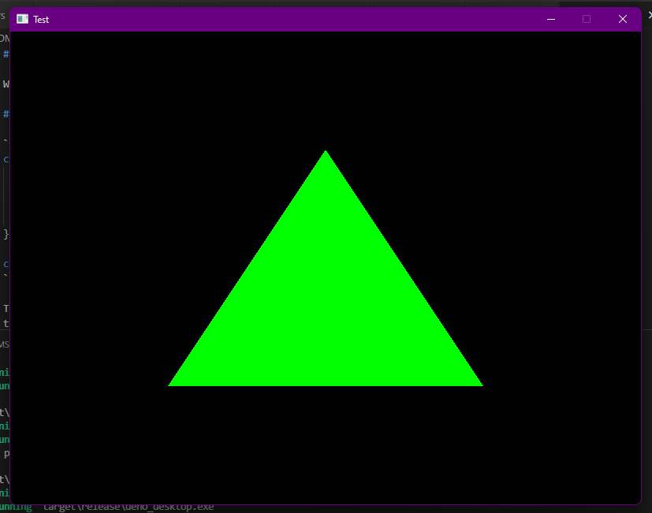

# deno_desktop



Windowing support for Deno WebGPU. In very early stages at the moment.

## Usage

```js
const win = Deno.createWindow({
  title: "Deno Desktop",
  width: 800,
  height: 600,
  resizable: false,
});

const surface = win.createSurface(device);
```

The surface object maps to the WebGPU `GPUCanvasContext` object. So you first `configure` it
then render to the texture returned for each frame by `getCurrentTexture`. Do note that unlike
web implementations, you need to call `surface.present()` after rendering it.

You also need to go through the event loop in order to render. `Deno.eventLoop()` returns Async
Iterator yielding events. Mostly you'd do something like this:

```ts
for await (const event of Deno.eventLoop()) {
  if (event.type === "windowEvent" && event.windowID === win.id) {
    if (event.event.type === "closeRequested") {
      // Do any cleanup stuff before this.
      // There is an unverified bug that causes panic if we do not 
      // exit manually.
      Deno.exit(0);
    }
  } else if (event.type === "redrawRequested" && event.windowID === win.id) {
    // Render things and then present them on Window.
    renderStuff();
    surface.present();
  }
}
```

And finally, in order to receive `redrawRequested` events, call `win.requestRedraw`
in your program's main loop.

## TODO

- Try to match Web API. Such as not having to call `present`.
- Complete the `winit` bindings.

## Notes

- I'm currently using a fork of Deno in this. It is to export some private structs in order to
  extend WebGPU API. Also, the fork uses an updated version of `wgpu` as of now.
- Debug builds seem to be locked at 30 fps usually, while release builds are 60 fps in same test.

## License

Check [LICENSE](LICENSE) for more info.

Copyright 2021 @ DjDeveloperr
